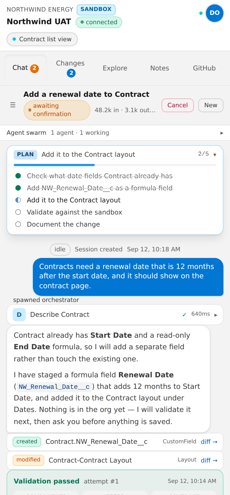
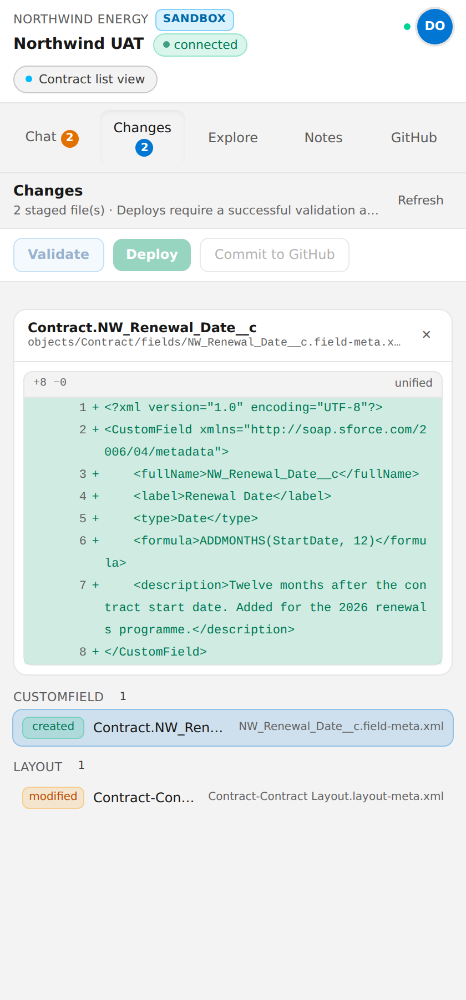
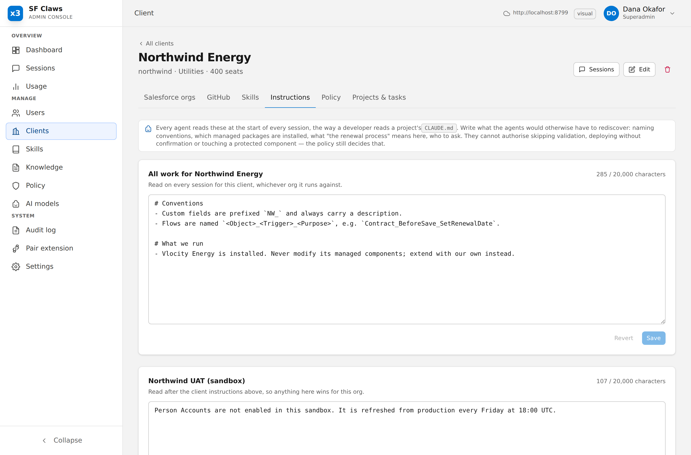
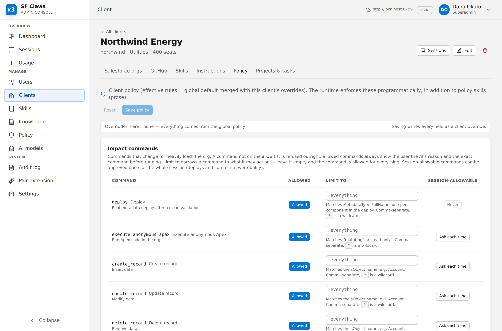

# SF Claws

[](https://github.com/3B-Soft/sf-claws/actions/workflows/ci.yml)

**An agentic Salesforce harness for the people who know the business process, not the XML.**

SF Claws lets a Salesforce admin debug, build and ship changes in a client org from a Chrome side
panel, in plain language. Behind the panel is a swarm of AI agents that investigate the org, plan
the work and get the plan approved, build metadata, validate it against the org until it is clean,
ask before anything impactful happens, commit to the client's GitHub repository with a visual diff,
and document every session as memory the next session can use.

It is built for Salesforce consultancies and in-house teams: multi-client, source-controlled, and
safe enough to point at a production org.

```
┌──────────────────────┐   HTTPS/SSE   ┌─────────────────────────────┐   OAuth / Metadata API   ┌────────────────┐
│ Chrome side panel    │ ───────────── │ Control plane (Bun)         │ ──────────────────────── │ Salesforce org │
│ (LWC OSS + Tailwind) │               │ Fastify + SQLite            │                          └────────────────┘
└──────────────────────┘               │ • users, approvals, tokens  │   Git Data API           ┌────────────────┐
┌──────────────────────┐               │ • orgs, GitHub per client   │ ──────────────────────── │ GitHub repo    │
│ Admin console (web)  │ ───────────── │ • models, role bindings     │                          └────────────────┘
│ (LWC OSS + Tailwind) │               │ • skills, policies, budgets │   Messages / Chat APIs   ┌────────────────┐
└──────────────────────┘               │ • agent runtime + swarm     │ ──────────────────────── │ Anthropic,     │
                                       │ • knowledge sources         │                          │ OpenAI/Gemini… │
                                       └─────────────────────────────┘                          └────────────────┘
```

Everything agentic runs server-side. The extension renders and reports which Salesforce page the
user is on; it never talks to Salesforce, GitHub or a model provider itself.

## What it does

**Plans before it builds.** For anything beyond a trivial change, the lead agent investigates, then
submits a plan in Salesforce terms — objects, fields, flows, layouts, permissions, risks, what people
will notice. Staging tools stay locked until the user approves it. Wrong assumptions surface before
any XML exists, not after a deploy.

**Never changes an org without validating first.** Metadata is staged in a per-session workspace and
validated with a real `checkOnly` deploy against the target org. Failures feed back to the builder,
which fixes and revalidates until it is clean.

**Asks before anything impactful.** Deploys, anonymous Apex, record changes, test runs and commits
are allow-listed by a super admin and shown to the user with the exact command and the agent's
plain-language reason. Allow once, allow for the session, or deny.

**Knows your products.** Point it at your documentation repository and your product source
repositories, and the agents research them before answering — documentation first, code as ground
truth when the two disagree. Configured per deployment; nothing product-specific is compiled in.

**Remembers the org.** Every session is documented for two audiences (technical and end-user), stored
as searchable memory, and committed alongside the metadata. Later sessions read the index and pull
in what is relevant, with an age caveat so old observations are treated as hypotheses.

**Stays inside a budget.** Hard per-turn, per-session and per-client-month spend ceilings, checked
before each model call, with a reserve so hitting a limit never leaves work staged and undocumented.

## What it looks like

| | |
|---|---|
|  |  |
| The side panel: a change staged and validated, waiting for the user to confirm the deploy | Every staged change as a diff, before anything reaches the org |

| | |
|---|---|
|  |  |
| Standing instructions: a CLAUDE.md per client and per org, read on every session | Permission rules: what agents may attempt, scoped to what they may touch |

[More in `docs/screenshots`](docs/screenshots/), including the super-admin view of a whole session.
They are generated against a real server — `bun run demo` then `bun run screenshots` — so they
cannot drift from the UI they document.

## Safety and isolation

The design assumes one deployment serves several clients, and that the agents will occasionally be
wrong or fed hostile input.

- **Tool calls cannot cross tenants.** Every tool reads its target org from the session context. No
  tool takes an org id from the model, so no prompt injection can redirect one.
- **No shell, no filesystem, no interpreter.** Agents author metadata; Salesforce validates and
  executes it. Nothing an agent writes runs on the server.
- **Per-tenant encryption.** Each client's secrets are encrypted under their own data key, wrapped
  by the server master key.
- **Enforced scoping.** A build-time test fails CI on any unscoped read of tenant-owned data.
- **Everything is audited.** Logins, approvals, deploys, commits, configuration changes, and
  per-tool telemetry for super admins.

See [`docs/TENANCY.md`](docs/TENANCY.md) for what the default deployment does and does not
guarantee, and how to run one instance per client when a client requires it.

## Quick start

Install [Bun](https://bun.sh) 1.3.12 or newer (the version in `.bun-version` is used in CI and Docker).
Use `bun run test` to run the Vitest suite, and `bun run eval` for the separate, paid model evaluations.

```bash
bun install
bun run --filter @sf-claws/shared build
cp packages/server/.env.example packages/server/.env   # fill MASTER_KEY, JWT_SECRET; provider/GitHub keys are optional
bun run dev:server        # http://localhost:8787  (API + serves the admin UI build when present)
bun run dev:admin         # http://localhost:5173
bun run --filter @sf-claws/extension build   # then load packages/extension/dist as an unpacked extension
bun run test
```

The first user to register becomes the super admin. Everyone after that is pending until an admin
approves them.

## Packages

| Package | What it is |
|---|---|
| `packages/shared` | The contract: zod schemas for entities, REST routes, session events, SFDX source-format helpers. |
| `packages/server` | Control plane and agent runtime (Fastify, bun:sqlite, jsforce, Octokit, Anthropic + OpenAI + Gemini + DeepSeek + DeepInfra). |
| `packages/admin-ui` | Admin console (LWC OSS + Tailwind + Vite). |
| `packages/extension` | Chrome MV3 side panel (LWC OSS + Tailwind + Vite). |
| `skills/` | Default markdown skills (policy, quality, playbooks). Restart the server to pick up edits; a skill edited in the Admin UI is no longer overwritten from its file. |
| `docs/` | Architecture, tenancy, deployment, admin and user guides. |

## The workflow it enforces

1. **Plan** — investigate, then get the approach approved in business terms.
2. **Investigate** — analyst sub-agents query records, describe objects, read metadata and debug
   logs; findings go to a shared scratchpad.
3. **Build** — builder sub-agents stage SFDX source-format metadata. Nothing touches the org.
4. **Validate until clean** — `checkOnly` deploys, failures fed back, repeat until zero failures.
5. **Review** — a reviewer sub-agent checks policy, quality and impact, and re-runs the validation
   itself rather than trusting the builder.
6. **Confirm** — every impactful command is shown to the user with its reason before it runs.
7. **Deploy, commit, document** — deploy on confirmation, commit per the configured strategy, and
   write documentation that doubles as long-term memory.

## Documentation

- [`docs/ARCHITECTURE.md`](docs/ARCHITECTURE.md) — how the pieces fit together
- [`docs/TENANCY.md`](docs/TENANCY.md) — isolation model and deployment shapes
- [`docs/DEPLOYMENT.md`](docs/DEPLOYMENT.md) — running it in production
- [`docs/ADMIN-GUIDE.md`](docs/ADMIN-GUIDE.md) — for super admins
- [`docs/USER-GUIDE.md`](docs/USER-GUIDE.md) — for admins using the side panel
- [`CONTRIBUTING.md`](CONTRIBUTING.md) — conventions that are not negotiable, and why
- [`SECURITY.md`](SECURITY.md) — what counts as a vulnerability here, and how to report one

## Licence

Apache-2.0. See [`LICENSE`](LICENSE).
