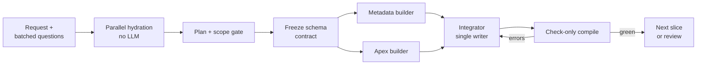

# SFClaws long-session optimization plan (revised)

## Conclusion

The session was slow because one model stream generated about nine times more text than it shipped, on top of code that never compiled. It was serial, but the fix is less output and earlier compilation, not more agents. Claude Code finished in 15–20 minutes as a single serial agent with a narrower scope.

This revision keeps the audit's evidence and most of its harness findings. It changes the order and the emphasis:

1. Measure the critical path before building anything.
2. Compile early and often against Salesforce, and forbid growth while errors are open.
3. Cut output volume: patch edits, an Apex pitfalls skill, no re-derivation by replacement builders.
4. Share facts across agents and replace research agents with parallel deterministic hydration.
5. Gate scope at plan approval.
6. Add budgets and retry control as soft limits first, hard limits after calibration.
7. Defer the phased release controller, the full dependency graph and org-to-Git sync until a session needs them.

The first week of this plan aims at sessions that succeed faster. The original first week made failing sessions cheaper, which is useful but is not the goal.

This plan changes no harness behavior and makes no Salesforce or GitHub writes.

## Evidence and limits

All figures come from the 2026-09-18 audit of session `ses_mu2wbhm7vam4v5pzeLzJ`. No new data was collected for this revision.

- Sources: `events_raw.md`, `transcript.md`, SFClaws PR `3B-Soft/reed-sfclaws#2`, Claude Code PR `3B-Soft/reed#1`, harness source at `76df5427`.
- The export is a Markdown rendering, not lossless event JSON. It holds 3,591 event blocks while sequence numbers reach 59,261.
- Usage events are cumulative. Take the last snapshot and never sum them.
- Claude Code's duration is user-reported. Its event log, cost and deploy receipts were not supplied.
- The two PRs implement different acceptance criteria and were produced by different models in different harnesses.

The timing analysis below is derived arithmetic on audit totals, not a measured critical path. WP0 exists to replace it with measurement.

## Where the time went

Output decoding explains almost the whole wall clock. 406,714 output tokens over about 103 active minutes is roughly 65 tokens per second, the rate of one model stream.

| Measure                            |                             Value | Reading                                                    |
| ---------------------------------- | --------------------------------: | ---------------------------------------------------------- |
| Active time (excluding user waits) |                          103m 25s | The budget being explained                                 |
| Output tokens                      |                           406,714 | About 65 tokens/s across active time                       |
| Shipped text diff                  |  +3,711 lines, roughly 45k tokens | Output was about 9x what shipped                           |
| Salesforce check-only validations  |                 5 runs, 71s total | About 14s each; 1% of active time                          |
| Average context per usage snapshot |   About 100k tokens (34.3M / 336) | Large prompts on every call                                |
| Time before first builder          | 44m 39s, 19m 11s of it user waits | About 25 minutes of research by six agents, 460 tool calls |
| Gap between validation 4 and 5     |                           55m 10s | Payload grew from 88 to 151 components on 10 open failures |
| Full-file writes / edit calls      |                         149 / 138 | Rewrites dominate output                                   |

Three conclusions follow.

**Concurrency was low, and it was not the main cost.** Perfect 3x parallelism would still have taken 35 minutes or more and produced the same uncompiled code. Cutting output by 5x reaches 20 minutes on one thread.

**The cheapest resource was used least.** A 14-second compile was run five times in two hours. The first run came 63 minutes after the request, against 70 components.

**The worst single event was the 55-minute gap.** The builders kept adding components while ten root failures stood open. Nothing in the harness stopped that.

The errors themselves were Java habits in Apex: nested static methods, inner batch classes, `limit` and `group` as identifiers, `HttpRequest.getTimeout()`, `Test.getRunId()`. The security skill loaded eight times; no skill covered Apex language pitfalls.

## What changes versus the original plan

The harness findings table in the audit stands. Seven positions change.

| Topic               | Original plan                                                                 | This revision                                                                                             | Reason                                                                     |
| ------------------- | ----------------------------------------------------------------------------- | --------------------------------------------------------------------------------------------------------- | -------------------------------------------------------------------------- |
| Remote validation   | Cap at 3 distinct candidates per phase; build local gates to avoid Salesforce | Compile small groups early and often; cap on no-progress, not count                                       | A check-only run costs about 14s and is the authoritative compiler         |
| Growth while broken | Advice to build a vertical slice first                                        | Hard controller invariant: no new components while root errors are open                                   | The 55-minute gap was the worst event and nothing enforced the advice      |
| Local checks        | Parser, symbol checks, metadata rules, dependency graph (4–7 days)            | Syntax-only parse plus about ten lint rules for observed errors (1 day)                                   | Salesforce covers semantics; the graph solves no observed failure          |
| First priority      | Budgets and circuit breakers                                                  | Timing telemetry, then compile-early                                                                      | Budgets turn a 2-hour failure into a 20-minute failure, not a success      |
| Budget values       | Hard limits from day one (300k tokens, 20 minutes)                            | Soft warnings first; hard after replay calibration                                                        | The values are untested; an 87% cut by fiat risks stopping every real task |
| Agents              | One writer, cap of four agents                                                | One integrator; parallel read-only hydration; parallel builders on disjoint files under a frozen contract | Hydration and schema-versus-Apex work are independent                      |
| Release and Git     | Two-phase release controller and org-to-Git sync in P1–P2                     | Deferred; one-time org retrieve as Git baseline now                                                       | Zero deployments happened in this session                                  |

Two items are new. An Apex pitfalls skill addresses the model-level cause of the compile errors. A same-model benchmark separates harness effects from model effects, which the PR comparison cannot do.

## Concurrency model

Parallelize work that needs no model and work on disjoint files. Keep integration, validation submission and deployment single-threaded per org.

Builders fan out only after the schema contract is frozen, and only the integrator submits compiles.

| Work                                         | Mode              | Rule                                                                               |
| -------------------------------------------- | ----------------- | ---------------------------------------------------------------------------------- |
| Describes, Tooling reads, metadata retrieves | Parallel, no LLM  | Fan out with a concurrency limit per org; coalesce identical in-flight requests    |
| Independent tool calls within one model turn | Parallel          | Scheduler runs read-only calls concurrently                                        |
| Metadata XML and Apex                        | Parallel builders | Allowed once field and object API names are frozen; disjoint file ownership        |
| Apex in one compile group                    | One builder       | Mutually dependent classes stay with one writer                                    |
| Compile checks                               | Background        | Builder continues on other files while a check runs; results return as diagnostics |
| Review                                       | Incremental       | Reviewer reads only green slices, never an uncompiled payload                      |
| Integration, validation submission, deploy   | Serial            | One integrator; one per-org lease                                                  |

A replacement agent is not parallelism. It inherits the handoff bundle and the session counters, and it may not restart discovery.

## Work packages

Seven packages, 14–21 engineering days for one engineer who knows the codebase. Estimates are planning figures, not delivery dates.

| #   | Package                              | Days | Main modules                                                                      | Exit condition                                                                                                    |
| --- | ------------------------------------ | ---: | --------------------------------------------------------------------------------- | ----------------------------------------------------------------------------------------------------------------- |
| WP0 | Timing telemetry and lossless export |  1–2 | `tools/audit-long-session.mjs`; event repository; admin session view              | Per-agent Gantt, model/tool/idle split and tokens per agent per phase exist for this session and all new ones     |
| WP1 | Compile-early invariant              |  2–3 | `agents/runtime.ts`, `tools.ts`; `salesforce/service.ts`                          | No component added while root errors are open; first compile within 10 minutes of first write                     |
| WP2 | Output reduction                     |  2–3 | `agents/prompts.ts`, `tools.ts`; skills; staging tools                            | Output tokens per shipped line fall by 5x on replay; observed Java-in-Apex errors rejected locally                |
| WP3 | Shared facts and handoff bundle      |  3–4 | `agents/agent.ts` (`readMemo`), `runtime.runSubagent`; `salesforce/connection.ts` | One network fetch per cache key and revision; a replacement agent makes zero repeat describes                     |
| WP4 | Parallel deterministic hydration     |  3–4 | New hydration service; `salesforce/service.ts`; `agents/prompts.ts`               | Research agents removed from the default path; first builder starts within 5 active minutes                       |
| WP5 | Plan-stage scope gate                |  1–2 | Planner prompt and plan schema; plan approval UI                                  | Every plan shows a component count and a minimal variant; extras are opt-in                                       |
| WP6 | Containment                          |  2–3 | `shared/src/domain.ts`; `agents/cost.ts`, `runtime.ts`; new retry controller      | Session-wide counters survive agent replacement and restart; `UNKNOWN_EXCEPTION` triggers zero model repair calls |

### WP0: timing telemetry

Extend the audit script to compute, from event timestamps, each agent's start and end, overlap between agents, and time in model generation, tool execution and idle. Add tokens per agent per phase.

Switch the export to lossless JSON or NDJSON with agent attribution. Run it on this session first. If the serial-decode reading is wrong, reorder WP1–WP4 before starting them.

### WP1: compile-early invariant

The controller, not the model, enforces three rules.

1. The first compile runs on the first coherent group, within 10 minutes of the first staged write.
2. While the root-error set is non-empty, tools that create new components are refused. Edits to failing files and their direct dependencies stay allowed.
3. No more than 10 minutes or 8 changed files pass without a compile.

Validate bounded groups, not the whole workspace. Use a Metadata API check-only deploy for groups that include new schema, since unstaged fields do not exist in the org. Use the Tooling API `ContainerAsyncRequest` with `IsCheckOnly` for Apex that compiles against existing schema.

Deduplicate diagnostics by root class or field and attach cascades to their cause. Remove "Iterate until it returns ok=true" from the validation tool description. Stop on no progress: two consecutive compiles without a smaller root-error set.

### WP2: output reduction

- Add an Apex pitfalls skill, loaded for every builder: no nested static methods, no inner `Database.Batchable`, reserved identifiers, no `ORDER BY` with `FOR UPDATE`, API members that do not exist.
- Make patch edits the default. Refuse a full-file write to an existing file above a size threshold unless more than half the file changes.
- Run a syntax-only Apex parse at staging, using the Jorje-backed serializer from the Prettier Apex project. Add lint rules for the error classes seen in attempts 3–5 and for metadata enum values, labels and string lengths.
- Stop scratchpad rewrites from counting as work. Cap scratchpad size and make updates append-only.
- Track output tokens per shipped line as a session metric.

### WP3: shared facts and handoff bundle

Replace the per-AgentRun `readMemo` with a shared cache keyed by tenant, org, access principal, API version, schema revision and resource. Coalesce concurrent misses. Cache skills by content hash.

A workspace edit does not invalidate live-org schema. A scratchpad or todo update invalidates nothing. Authorization and transport failures are never recorded as absence; fix the catch-all "treat as created" path in `stageWorkspaceFile`.

Every child agent starts with a bundle stored outside conversation history: requirements, user decisions, frozen contracts, allowed files, relevant source, verified schema, staged schema delta, open root errors and remaining budget. Compaction and replacement reattach the bundle by identity. Stable content sits before the prompt cache boundary; budget and error state sit after it.

### WP4: parallel deterministic hydration

Build the target set without a model: API names in the request, user-selected components, page context and local search. Fan out describes, Tooling reads and metadata retrieves with a per-org concurrency limit. Project only the relevant fields into context.

Persist a hydration manifest: source, identity, API version, retrieval time, content hash, and status verified, absent, unavailable or stale. New dependencies found later trigger a bounded second pass, never global rediscovery.

Batch genuinely dependent user questions into one questionnaire and store answers as requirements. As the Git baseline, do one full org retrieve into the repository so PR diffs separate changes from imports.

### WP5: plan-stage scope gate

The planner emits a component estimate: new objects, CMDT types, classes, triggers and existing files touched. The approval screen shows it next to a minimal variant that meets the stated requirements only.

Operational extras such as retention, leases, generalized registries and webhook rewrites are listed separately and default to off. Every edit to an existing file must cite a requirement or a confirmed dependency. `SendGridWebhook` changes need regression tests for existing behavior.

### WP6: containment

Persist session-wide counters for attempts, repairs, spawns, tool calls and tokens. Spawning, resuming or restarting does not reset them.

Classify remote failures: platform internal, transport uncertainty, component validation, test or coverage, auth, quota. `UNKNOWN_EXCEPTION` retries the archived payload unchanged after 15s and 45s with jitter, holds a per-org lease, reconciles any existing job ID, and never reaches the repair prompt.

Archive the exact payload and workspace tree before each remote attempt, using the existing DB workspace. If a comparable compile has more root errors than the one before, quarantine it and restore the previous checkpoint. Reserve tokens atomically before every provider call, including summaries and fallbacks.

## Budgets and circuit breakers

Limits ship in two stages: soft warnings with telemetry first, hard stops after ten or more replay and live sessions. Progress-based stops are hard from day one, because they do not depend on tuned numbers.

| Control                             | Stage 1 (soft, warn and log) | Stage 2 (hard)                              |
| ----------------------------------- | ---------------------------- | ------------------------------------------- |
| Uncached input + output tokens      | Warn at 300,000              | Set at p90 of successful sessions plus 25%  |
| Output tokens                       | Warn at 60,000               | Same method                                 |
| Active execution time               | Warn at 20 minutes           | Same method; pauses for explicit user waits |
| Child agents, replacements included | Warn at 4                    | Hard at calibrated value                    |
| Dollar ceiling                      | Nonzero default per profile  | Kept alongside token and time caps          |

| Hard from day one                                     | Value                                           |
| ----------------------------------------------------- | ----------------------------------------------- |
| New components while root errors are open             | Refused                                         |
| Building without a compile                            | 10 minutes or 8 changed files                   |
| Consecutive compiles without a smaller root-error set | 2, then stop with checkpoint                    |
| Unchanged failed payload resubmitted                  | Refused, except through the platform retry path |
| Transient platform retries                            | 2 per phase, unchanged payload                  |
| Concurrent integrators per org                        | 1                                               |

Progress means a newly satisfied requirement, a smaller root-error set, a passing local gate or a green compile. More files, a rewritten scratchpad or another agent do not count.

On a hard stop the harness cancels queued model work, reconciles any running Salesforce job, and writes a deterministic status report without another model call. A task that exceeds its profile stops with saved work and an explicit scope or budget decision for the user.

There is no cap on the number of check-only compiles. The no-progress rule bounds them.

## Deferred work

Three items from the original plan wait for a trigger. Their designs in the audit remain valid and should be reused when the trigger fires.

| Item                                                     | Original estimate | Trigger to start                                                                                      | Kept from the original design                                                                                                                                                                        |
| -------------------------------------------------------- | ----------------: | ----------------------------------------------------------------------------------------------------- | ---------------------------------------------------------------------------------------------------------------------------------------------------------------------------------------------------- |
| Two-phase release controller                             |          5–9 days | First sessions reach a green full-payload compile and need deployment                                 | Schema committed and verified before code; phase states; approval fingerprints bound to exact payloads; no silent upgrade of check-only to deploy; org rollback treated separately from Git rollback |
| Dependency graph (Graphology, typed edges, SCC grouping) |          4–7 days | WP1 compile groups chosen by simple heuristics prove wrong or too coarse in more than 20% of sessions | Collapse strongly connected Apex into one compile group; explicit unresolved edges for dynamic SOQL and reflection                                                                                   |
| Org-to-Git sync with leases and compare-and-swap         |          4–6 days | Multiple concurrent sessions or admins change the same org, or baseline drift causes a wrong diff     | Never publish a partial retrieve; per-org lease; provenance on main; one org per mirrored main                                                                                                       |

Existing protections stay as they are: XML well-formedness checks, tool-result artifact spilling, safe tool scheduling, projected cost checks, review and workspace hashes, deploy approval fingerprints and `rollbackOnError: true`.

## Acceptance tests, benchmarks and targets

Controller tests use the existing scripted providers, in-memory SQLite and stub Salesforce service. Fixtures are minimal and redacted, cut from this session.

1. With ten open root errors, a tool call that creates a new component is refused. An edit to a failing file is accepted.
2. Fifteen minutes of scripted building without a compile triggers a forced compile at the 10-minute mark.
3. A failing class with ten dependents yields one repair target with its cascade attached.
4. Fixtures from attempts 3–5 are rejected at staging: invalid enum, missing label, overlong description, reserved identifiers, nested static methods, inner batch classes.
5. A full-file write that changes 5% of an existing file is refused with a patch hint.
6. Two concurrent agents request the same describe: one network request, same revision for both. Different tenants, orgs or principals never share data.
7. A replacement agent starts with the production formula, completion semantics, frozen contracts and open root errors. It makes zero repeat describes.
8. An authorization failure on a metadata read is recorded as unavailable, never as a newly created component.
9. Hydration for a ten-object target set completes with parallel fetches under the per-org limit and no model call.
10. Identical `UNKNOWN_EXCEPTION` results trigger timed unchanged retries and zero model repair calls. A lost submission response does not create a duplicate job.
11. A 26 → 10 → 53 root-error sequence on a comparable scope restores the second checkpoint. A changed manifest is reported as a new lineage.
12. Counters survive child replacement, resume and server restart. Summarizer and fallback calls count.
13. Cancellation stops queued and model work; in-flight Salesforce jobs are reconciled and recorded across restart.

### Benchmarks

Run three configurations on identical org snapshots, user answers and acceptance tests, at least five trials each. Report median and p95, with user waits excluded.

| Configuration                                             | Purpose                                              |
| --------------------------------------------------------- | ---------------------------------------------------- |
| Narrow scope, SFClaws harness, current model              | Harness efficiency against the Claude Code reference |
| Narrow scope, SFClaws harness, the model Claude Code used | Separates model effect from harness effect           |
| Expanded approved scope, SFClaws harness                  | Checks that the invariants hold on a large task      |

### Targets after WP0–WP5

| Metric                                                   |                     This session |                  Target |
| -------------------------------------------------------- | -------------------------------: | ----------------------: |
| Active time, narrow benchmark                            |         103 min (expanded scope) |        15–20 min median |
| Time to first builder                                    |                          44m 39s |  Under 5 active minutes |
| Time to first compile                                    |                           63 min | Under 15 active minutes |
| Longest gap between compiles while building              |                           55 min |                  10 min |
| Output tokens per shipped line                           |                        About 110 |                Under 25 |
| Uncached input + output tokens                           |                        2,367,470 |               80% lower |
| Repeat describes within a valid revision                 | 55 describes, Assignment 9 times |               0 repeats |
| Remote submissions with locally detectable syntax errors |                           2 of 5 |                       0 |

For the expanded scope, success within budget or an early useful checkpoint is the goal. No speed promise applies to it yet.

Quality gates do not move: unchanged acceptance criteria, passing Salesforce tests and coverage, regression coverage for existing integrations, zero unrelated file edits, and no claim of deployment or throughput without a receipt.
