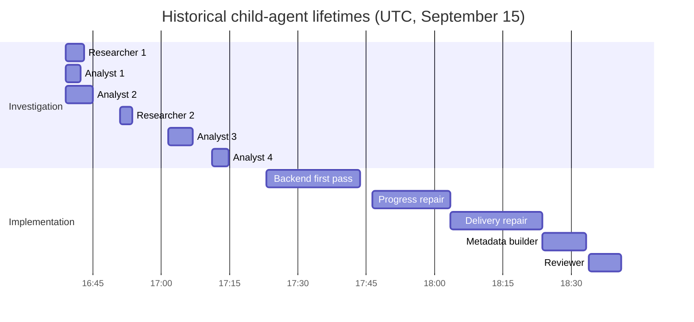

# WP0: measured baseline and telemetry delivery

Reproduction: `npm run build -w @sf-claws/shared`, then
`node tools/audit-long-session.mjs _long_session_logs/events_raw.md`.
The same script accepts the new session NDJSON export or a JSON event array.

The supplied historical export yields 103m 24.331s active time and 19m 11.303s in explicit
question/plan waits. Leaf-tool intervals account for 7m 34.935s of active wall time after
unioning overlap and excluding parent delegation and approval wrappers. The remaining
95m 49.396s is **unattributed**, not measured decoding or idle time. No per-call model spans
exist in this export, so tokens per agent and phase are unavailable. All 2,367,470 uncached
input/output tokens remain unattributed to agents; cached input is also unavailable per agent.

There were three concurrent child-agent lifetimes during the initial investigation. Subsequent
builders ran serially. Lifetimes include their tool calls and waits; they do not measure concurrent
model inference. The revised plan's decoding hypothesis remains plausible but unproven. These
measurements provide no reason to reorder compile-early and output reduction.

New runs record paired model events for each provider attempt, including fallback, retry,
compaction and forced-report calls. Failed calls retain unknown usage rather than zero usage.
The Timing tab displays agent lifetimes, wall-time categories, per-agent output, and token totals
by agent/phase/purpose. Phase attribution follows agent role and plan approval, rather than an
extra model call. The export is lossless for persisted events; transient text/thinking chunks are
explicitly excluded in its manifest. Existing historical gaps cannot be repaired retroactively.

WP0 ships without changing the planner, compile policy, budgets, or deployment behavior. WP1 is
the next implementation slice: compile coherent groups early, prevent expansion while root
errors remain, and bound repair by progress. The deferred graph, org sync and phased-release
controller remain deferred as requested in the revised plan.
