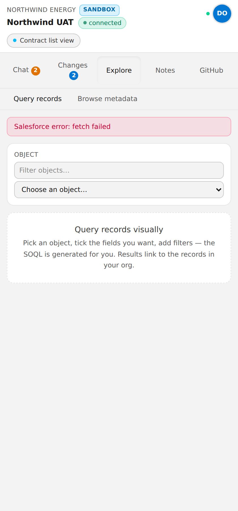
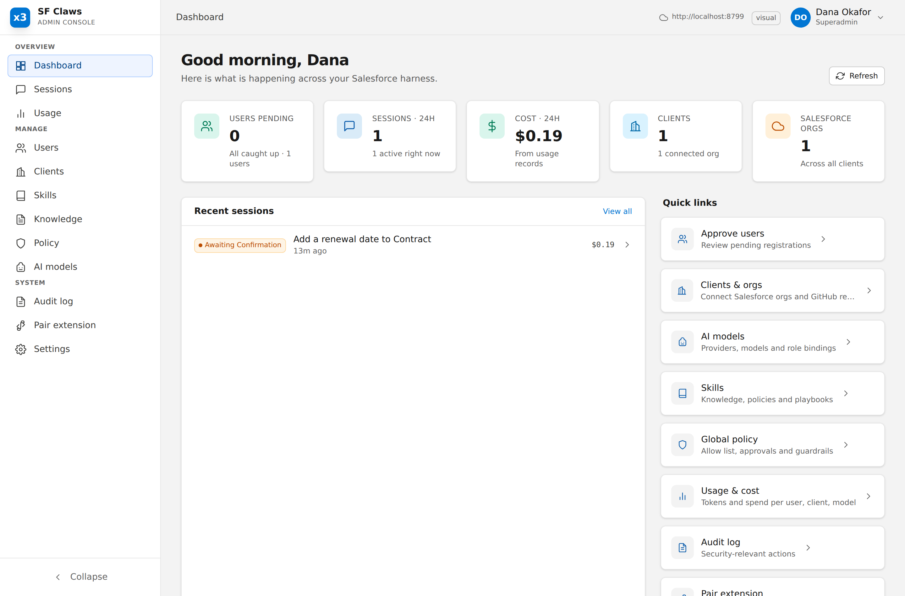
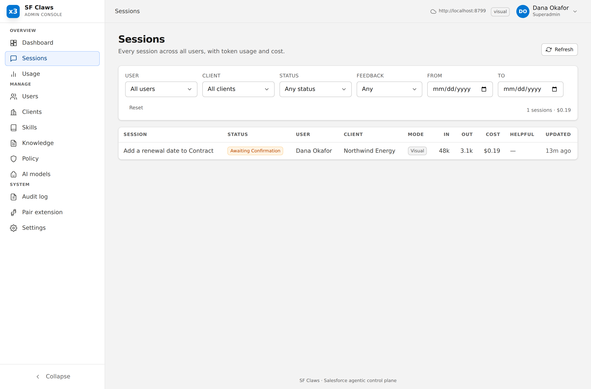
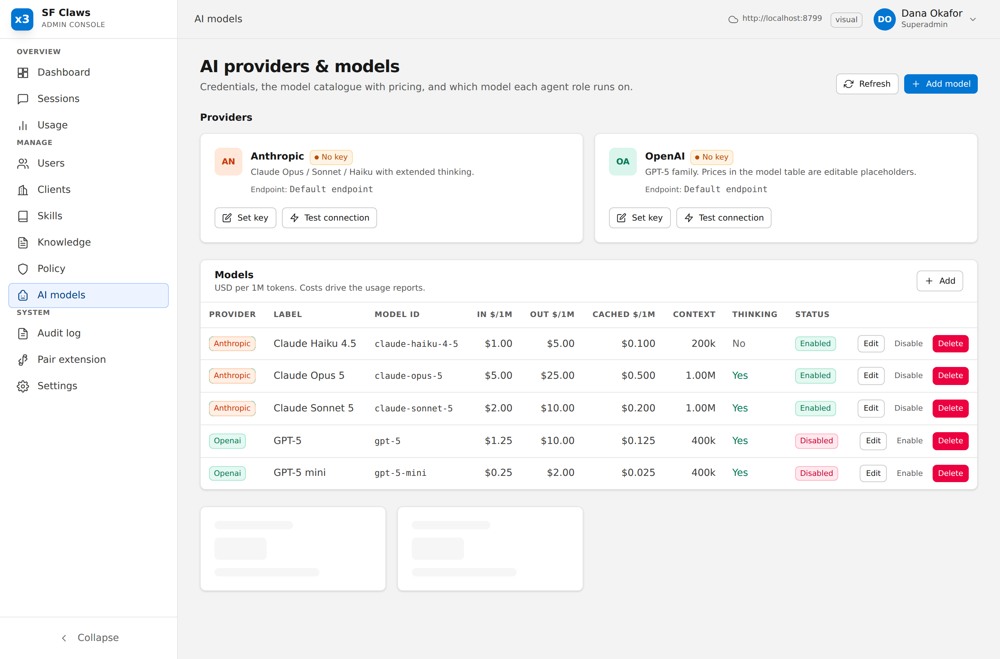
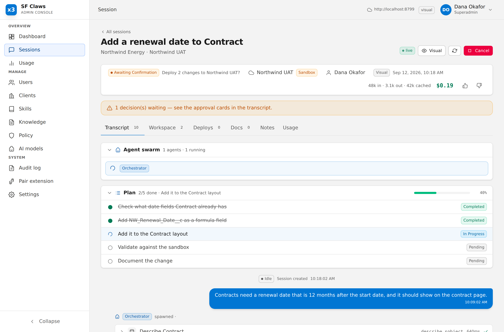

# Screenshots

Generated by `tools/screenshots.mjs` against a real server (`tools/demo-server.mjs`) with seeded data.
Regenerate rather than editing: they should never drift from the UI they document.

### The side panel: a staged change, validated, waiting for the user to confirm the deploy

### Every staged change as a diff, before anything reaches the org

### Browse and query the org without leaving the panel

### Admin console: what every client and every session is doing

### Every session, with what it cost and how it ended

### Standing instructions: a CLAUDE.md per client and per org, read on every session

### Permission rules: what agents may attempt, scoped to what they may touch

### Model bindings per agent role, with per-role spend

### One session end to end: every tool call, every result, every token

`bun run contrast` runs the same harness against every screen and fails any text below WCAG AA on
its real composited background. Run it after any styling change: a theme flip breaks text in ways a
screenshot review does not catch, because the text is still there — just unreadable.
